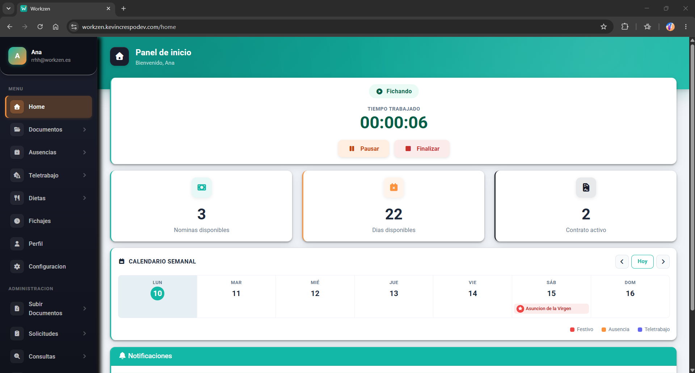
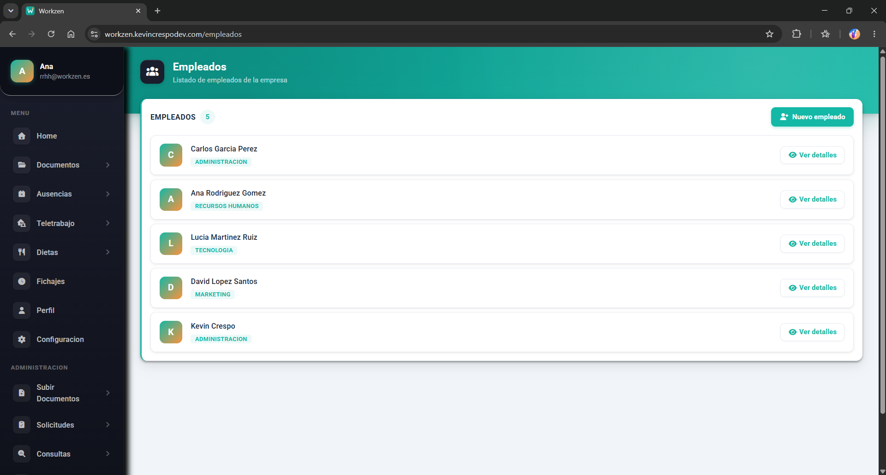
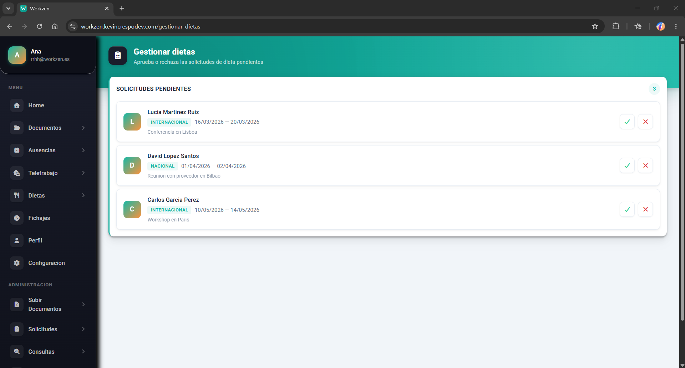
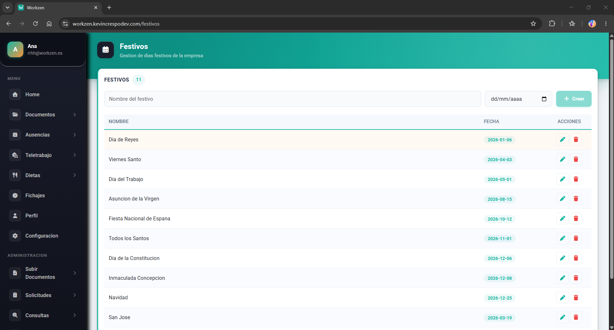
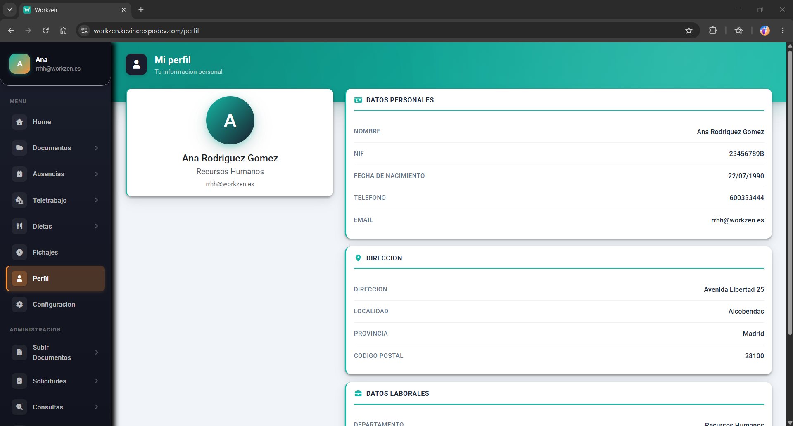
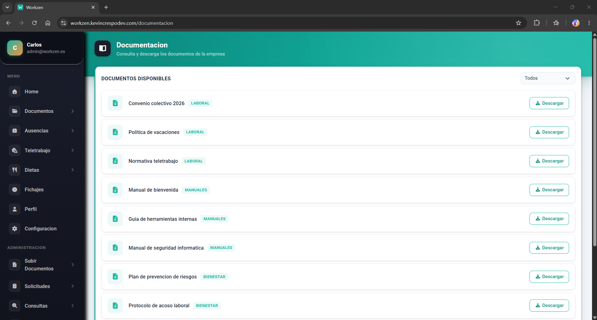
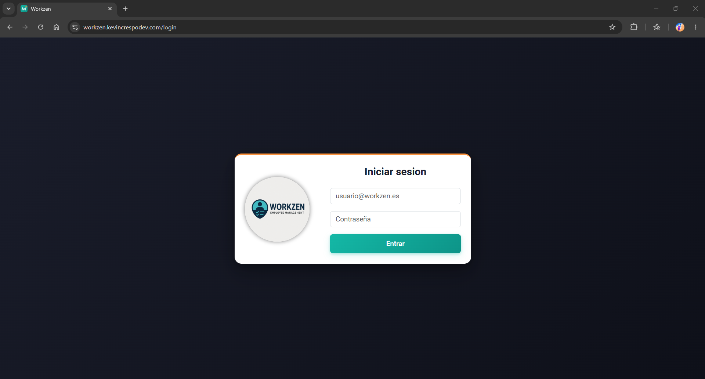

# Workzen

Aplicación web de gestión laboral y control horario: fichajes, ausencias, teletrabajo, dietas, nóminas, contratos y calendario laboral.

**Stack:** Java 21 · Spring Boot · Spring Data JPA · Spring Security · JWT · MySQL/MariaDB · Angular

---

## Sobre este repositorio

Proyecto final del CFGS de Desarrollo de Aplicaciones Web, desarrollado en equipo.

Mi aportación fue el **backend**: diseño e implementación de la base de datos y desarrollo de la API REST. Este repositorio es un volcado del proyecto completo (backend, frontend y esquema de base de datos) subido de forma independiente al repositorio compartido del equipo, por lo que el historial de commits no refleja el desarrollo original.

---

## Capturas

### Panel del empleado

Fichaje en curso con cronómetro, contadores de nóminas y días disponibles, y calendario semanal con festivos y ausencias.



### Gestión de empleados (RR.HH.)



### Aprobación de solicitudes

Flujo de aprobación y rechazo de dietas, ausencias y teletrabajo.



### Calendario laboral



### Perfil del empleado



### Documentación corporativa



### Acceso



---

## Funcionalidades

**Empleado**

- Fichaje de jornada con inicio, pausas, reanudación y cierre
- Consulta del historial de fichajes por mes
- Solicitud de ausencias (vacaciones, médico, permisos) con subida de justificantes
- Solicitud de teletrabajo y de dietas
- Descarga de nóminas, contratos y certificados
- Consulta de documentación corporativa
- Calendario semanal con festivos, ausencias y teletrabajo
- Notificaciones

**Administración y RR.HH.**

- Alta, edición y consulta de empleados
- Gestión de departamentos y del calendario de festivos
- Aprobación y rechazo de solicitudes de ausencia, teletrabajo y dietas
- Subida de nóminas, contratos, certificados y documentación
- Consulta de fichajes de toda la plantilla

---

## Arquitectura del backend

Arquitectura por capas:

```
restcontroller/   → Controladores REST y documentación OpenAPI
service/          → Interfaces de servicio e implementaciones (lógica de negocio)
modelo/
  ├── entities/   → Entidades JPA
  ├── dto/        → DTOs de entrada y salida
  └── repository/ → Repositorios Spring Data JPA
security/         → Configuración de Spring Security, filtro y utilidades JWT
config/           → Configuración de OpenAPI y directorios de subida
```

Puntos destacados:

- **DTOs en todas las respuestas**: las entidades JPA nunca se exponen directamente en la API.
- **Autenticación stateless con JWT**: el token incluye el email y los privilegios del usuario; un `OncePerRequestFilter` lo valida y construye el contexto de seguridad en cada petición.
- **Autorización por roles** (`admin`, `rrhh`, `empleado`) declarada en la cadena de filtros de Spring Security.
- **Contraseñas hasheadas con BCrypt**.
- **Configuración por perfiles** (`local` y `prod`), con credenciales inyectadas por variables de entorno en producción.
- **Gestión de ficheros** en disco para nóminas, contratos, certificados y justificantes, con rutas configurables por perfil.

---

## Base de datos

Modelo relacional de 18 tablas en MySQL/MariaDB, con integridad referencial, restricciones de unicidad y tipos enumerados para los estados de negocio.

Entidades principales: usuarios, privilegios, empleados, departamentos, fichajes, pausas, ausencias, justificantes, teletrabajo, dietas, nóminas, contratos, certificados, documentos, festivos y notificaciones.

Los scripts están en `database/`:

- `create.sql` — creación del esquema
- `insert.sql` — datos de prueba

---

## Puesta en marcha

### Requisitos

- Java 21
- Maven 3.9+
- MySQL 8 o MariaDB
- Node.js 20+ y Angular CLI (solo para el frontend)

### Base de datos

```bash
mysql -u root -p < database/create.sql
mysql -u root -p < database/insert.sql
```

### Backend

Edita `backend/src/main/resources/application-local.properties` con tus credenciales de base de datos y tu clave JWT, y arranca:

```bash
cd backend
./mvnw spring-boot:run
```

La API queda disponible en `http://localhost:8085`.

### Documentación de la API

Con el perfil `local` activo, Swagger UI está en:

```
http://localhost:8085/swagger-ui.html
```

### Frontend

```bash
cd frontend
npm install
ng serve
```

Disponible en `http://localhost:4200`.

---

## Despliegue

La aplicación estuvo desplegada en un VPS con Linux y MariaDB, con Apache como proxy inverso hacia el Tomcat embebido de Spring Boot, el backend corriendo como servicio `systemd` y despliegue automático mediante GitHub Actions al hacer push a `main`.

Detalles en [DEPLOYMENT.md](DEPLOYMENT.md).

---

## Autor

**Kevin Crespo** — [LinkedIn](https://www.linkedin.com/in/kevincrespodev/) · [GitHub](https://github.com/kevincrespo)
